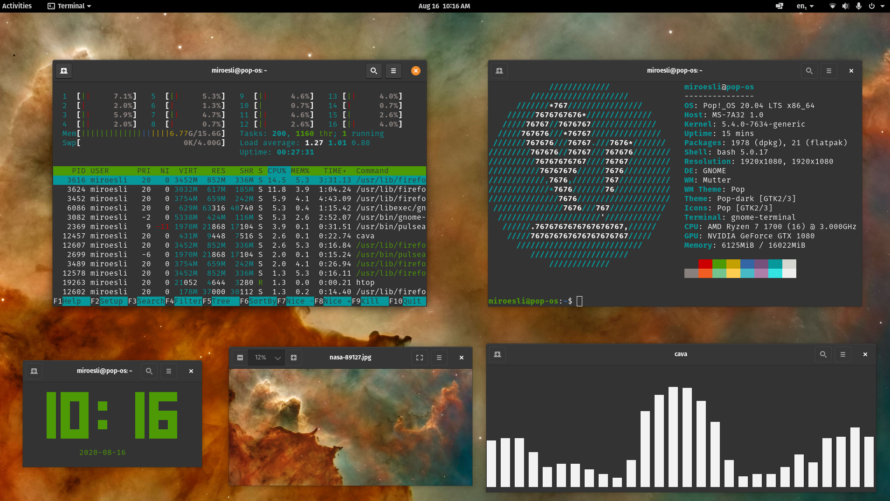
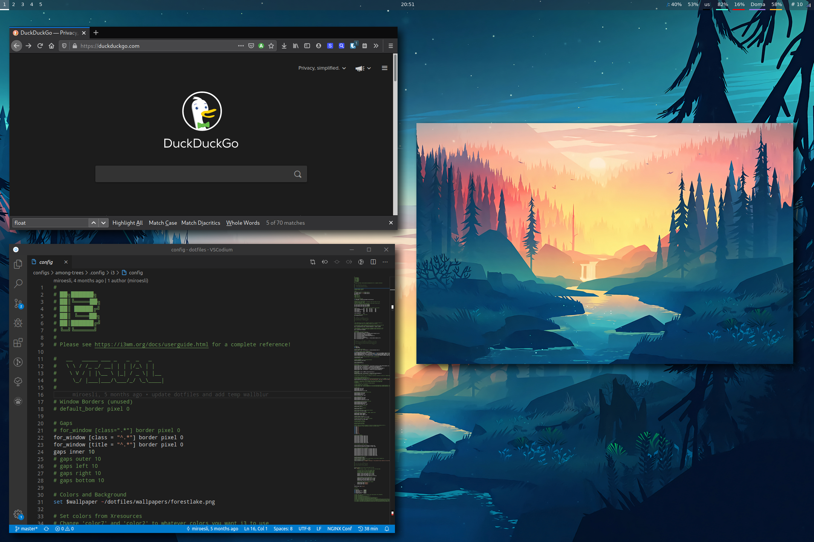

My `~ sweet ~` of configuration files.

  <a href="#details">Details</a> •
  <a href="#gallery">Gallery</a> •
  <a href="#installation">Installation</a> •
  <!-- <a href="#keybinds">Keybinds</a> • -->
  <a href="#contributing">Contributing</a> 

---

Welcome to my dotfiles. These configs are an iterative process and will be continually improved.

<strong>Table of Contents</strong>

<!-- vim-markdown-toc GFM -->

* [Details](#details)
* [Gallery](#gallery)
  * [Old Configs](#old-configs)
* [Installation](#installation)
  * [Dotfiles](#dotfiles)
  * [Firefox](#firefox)
* [Contributing](#contributing)
* [Licence](#licence)
* [Credits & Thanks](#credits--thanks)

<!-- vim-markdown-toc -->

## Details

Below is a list of the tools I use for my current setup.

- [**Operating System**](https://en.wikipedia.org/wiki/Operating_system) --- [Archlinux](https://www.archlinux.org/)
- [**Boot Loader**](https://wiki.archlinux.org/index.php/Arch_boot_process#Boot_loader) --- [Grub](https://wiki.archlinux.org/index.php/GRUB)
- [**Window Manager**](https://wiki.archlinux.org/index.php/Window_manager) --- [i3-gaps](https://wiki.archlinux.org/index.php/I3)
- [**Display Manager**](https://wiki.archlinux.org/index.php/Display_manager) --- [None]()
- [**Screen Locker**](https://wiki.archlinux.org/index.php/List_of_applications/Security#Screen_lockers) --- [None]()
- [**GTK**](https://wiki.archlinux.org/index.php/GTK) --- [gruvbox-gtk](https://github.com/jmattheis/gruvbox-dark-gtk) 
- [**Icons**](https://wiki.archlinux.org/index.php/Icons) --- [gruvbox-material](https://aur.archlinux.org/packages/gruvbox-material-icon-theme-git/)
- [**Cursor**](https://wiki.archlinux.org/index.php/Cursor_themes) --- [vimix](https://aur.archlinux.org/packages/vimix-cursors/)
- [**Shell**](https://wiki.archlinux.org/index.php/Command-line_shell) --- [Zsh](https://wiki.archlinux.org/index.php/Zsh) using [powerlevel10k theme](https://aur.archlinux.org/packages/zsh-theme-powerlevel10k-git/) 
- [**Terminal**](https://wiki.archlinux.org/index.php/List_of_applications/Utilities#Terminal_emulators) --- [Alacritty](https://wiki.archlinux.org/index.php/Alacritty)
- [**Bar**](https://en.wikipedia.org/wiki/Status_bar) --- [Polybar](https://wiki.archlinux.org/index.php/Polybar)
- [**Compositor**](https://wiki.archlinux.org/index.php/Xorg#Composite) --- [Picom](https://wiki.archlinux.org/index.php/Picom)
- [**Notification Daemon**](https://wiki.archlinux.org/index.php/Desktop_notifications) --- [Dunst](https://wiki.archlinux.org/index.php/Dunst)
- [**Application Launcher**](https://wiki.archlinux.org/index.php/List_of_applications/Other#Application_launchers) --- [Rofi](https://wiki.archlinux.org/index.php/Rofi)
- [**File Manager**](https://wiki.archlinux.org/index.php/File_manager_functionality) --- [PCManFM](https://wiki.archlinux.org/index.php/PCManFM) and [Thunar](https://wiki.archlinux.org/index.php/Thunar)
- [**Text Editor**](https://wiki.archlinux.org/index.php/List_of_applications#Text_editors) --- [Neovim](https://wiki.archlinux.org/index.php/Neovim) 
- [**Web Browser**](https://wiki.archlinux.org/index.php/List_of_applications/Internet#Web_browsers) --- [Firefox](https://wiki.archlinux.org/index.php/Firefox)

## Gallery

In progress...
<!--  -->

### Old Configs

Pillars-of-Creation (March - August 2020)

Small-Memory (October 2019 - March 2020)

## Installation

### Dotfiles

### Firefox

For the same firefox setup, just install the following.

- Theme : [gruvbox-true-dark](https://addons.mozilla.org/en-US/firefox/addon/gruvbox-true-dark/)
- Search Engine: [DuckDuckGo](https://duckduckgo.com/)
- Add-Ons:
  - Password Manager: [Bitwarden](https://bitwarden.com/download/)
  - Add/Script Blocker: [uBlockOrigin](https://ublockorigin.com/)
  - Facebook Privacy: [Facebook Container](https://addons.mozilla.org/en-US/firefox/addon/facebook-container/)
  - Secure HTTPS: [HTTPS Everywhere](https://www.eff.org/https-everywhere)
  - Secure Content Delivery: [Decentraleyes](https://decentraleyes.org/)
  - Dark Mode Everywhere: [Darkreader](https://darkreader.org/)

<!-- ### Zsh -->
<!-- ## Keybinds -->

## Contributing

## Licence

## Credits & Thanks

