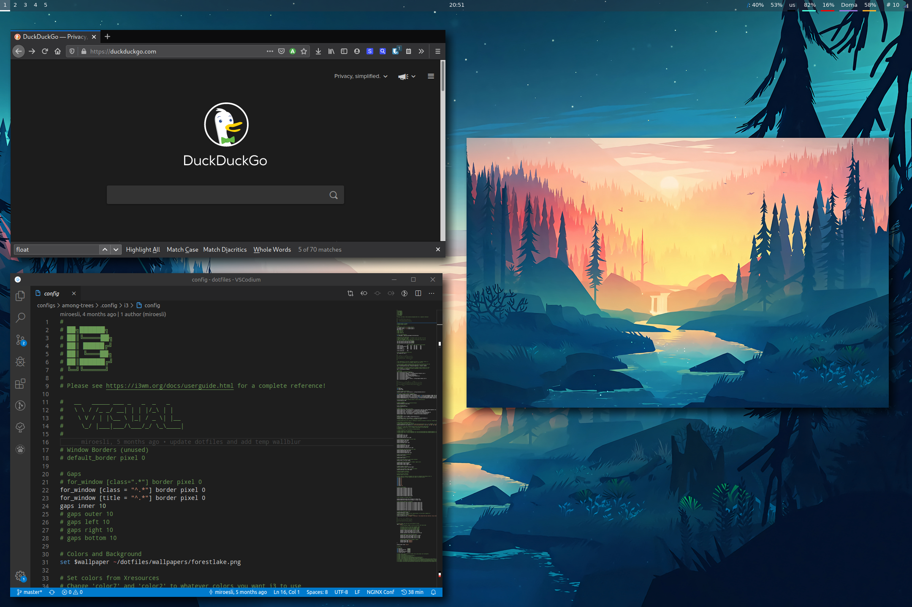

<p align="center"><a name="top" href="#Details"></a></p>

<p align="center"><em>My `~ sweet ~` of configuration files.</em></p>

<p align="center">
  <a href="#details">Details</a> •
  <a href="#gallery">Gallery</a> •
  <a href="#installation">Installation</a> •
  <a href="#keybinds">Keybinds</a> •
  <a href="#contributing">Contributing</a> 
</p>

---


Welcome to my dotfiles! :octocat: A one step installer is provided in the [Installation](#Installation) section below. These configs are also an iterative process and will be continuously improved.


<details open>
<summary style="font-size:26px"><strong>Table of Contents</strong></summary>
<!-- vim-markdown-toc GFM -->

* [:page_facing_up: Details](#page_facing_up-details)
* [:camera: Gallery](#camera-gallery)
* [:zap: Installation](#zap-installation)
  * [:lock: Prerequisites](#lock-prerequisites)
  * [:eight_spoked_asterisk: Dotfiles](#eight_spoked_asterisk-dotfiles)
  * [:postbox: Packages](#postbox-packages)
  * [:fox_face: Firefox](#fox_face-firefox)
* [:musical_keyboard: Keybinds](#musical_keyboard-keybinds)
* [:cd: Old Configs](#cd-old-configs)
* [:computer: Contributing](#computer-contributing)
* [:scroll: Licence](#scroll-licence)
* [:hearts: Credits & Thanks](#hearts-credits--thanks)

<!-- vim-markdown-toc -->
</details>

## :page_facing_up: Details

Below is a list of the tools I use for my current setup.

- [**Operating System**](https://en.wikipedia.org/wiki/Operating_system) --- [Archlinux](https://www.archlinux.org/)
- [**Boot Loader**](https://wiki.archlinux.org/index.php/Arch_boot_process#Boot_loader) --- [Grub](https://wiki.archlinux.org/index.php/GRUB)
- [**Window Manager**](https://wiki.archlinux.org/index.php/Window_manager) --- [i3-gaps](https://wiki.archlinux.org/index.php/I3)
- [**Display Manager**](https://wiki.archlinux.org/index.php/Display_manager) --- [None]()
- [**Screen Locker**](https://wiki.archlinux.org/index.php/List_of_applications/Security#Screen_lockers) --- [None]()
- [**GTK**](https://wiki.archlinux.org/index.php/GTK) --- [gruvbox-gtk](https://github.com/jmattheis/gruvbox-dark-gtk) 
- [**Icons**](https://wiki.archlinux.org/index.php/Icons) --- [gruvbox-material](https://aur.archlinux.org/packages/gruvbox-material-icon-theme-git/)
- [**Cursor**](https://wiki.archlinux.org/index.php/Cursor_themes) --- [vimix](https://aur.archlinux.org/packages/vimix-cursors/)
- [**Shell**](https://wiki.archlinux.org/index.php/Command-line_shell) --- [Zsh](https://wiki.archlinux.org/index.php/Zsh) using [powerlevel10k theme](https://aur.archlinux.org/packages/zsh-theme-powerlevel10k-git/) 
- [**Terminal**](https://wiki.archlinux.org/index.php/List_of_applications/Utilities#Terminal_emulators) --- [Alacritty](https://wiki.archlinux.org/index.php/Alacritty)
- [**Bar**](https://en.wikipedia.org/wiki/Status_bar) --- [Polybar](https://wiki.archlinux.org/index.php/Polybar)
- [**Compositor**](https://wiki.archlinux.org/index.php/Xorg#Composite) --- [Picom](https://wiki.archlinux.org/index.php/Picom)
- [**Notification Daemon**](https://wiki.archlinux.org/index.php/Desktop_notifications) --- [Dunst](https://wiki.archlinux.org/index.php/Dunst)
- [**Application Launcher**](https://wiki.archlinux.org/index.php/List_of_applications/Other#Application_launchers) --- [Rofi](https://wiki.archlinux.org/index.php/Rofi)
- [**File Manager**](https://wiki.archlinux.org/index.php/File_manager_functionality) --- [PCManFM](https://wiki.archlinux.org/index.php/PCManFM) and [Thunar](https://wiki.archlinux.org/index.php/Thunar)
- [**Text Editor**](https://wiki.archlinux.org/index.php/List_of_applications#Text_editors) --- [Neovim](https://wiki.archlinux.org/index.php/Neovim) 
- [**Web Browser**](https://wiki.archlinux.org/index.php/List_of_applications/Internet#Web_browsers) --- [Firefox](https://wiki.archlinux.org/index.php/Firefox)

## :camera: Gallery

The [gruvbox dark mode palette]() by `Pavel Pertsev` is used for the theme.


In progress...
<!--  -->


## :zap: Installation

### :lock: Prerequisites

- A Unix operating system
- One of `curl`, `wget`, or `fetch` 
- `find`, `grep`, and `git` for overall install
- (optional) `stow` and `ln` for hard linking configs and files

### :eight_spoked_asterisk: Dotfiles

The dotfiles are installed by running one of the following commands in your terminal. 

| Method    | Command                                                                                           |
|:----------|:--------------------------------------------------------------------------------------------------|
| **curl**  | `sh -c "$(curl -fsSL https://raw.githubusercontent.com/miroesli/dotfiles/master/tools/install.sh)"` |
| **wget**  | `sh -c "$(wget -O- https://raw.githubusercontent.com/miroesli/dotfiles/master/tools/install.sh)"`   |
| **fetch** | `sh -c "$(fetch -o - https://raw.githubusercontent.com/miroesli/dotfiles/master/tools/install.sh)"` |

Additional parameters can be specified including:

- `--link` for creating hard links for easier file management with the repository
- `--no-backup` for replacing existing configs without backing them up
- `--verbose` for a more detailed output of the installation process

These are simply appended to the install script as seen below

```sh
sh -c "$(curl -fsSL https://raw.githubusercontent.com/miroesli/dotfiles/master/tools/install.sh)" "" --no-backup --link --verbose
```

### :postbox: Packages

You can quickly install all the packages I use for archlinux by using the command below.

```sh
sudo pacman -S - < PACKAGES.md
```

### :fox_face: Firefox

For the same firefox setup, just install the following.

- Theme : [gruvbox-true-dark](https://addons.mozilla.org/en-US/firefox/addon/gruvbox-true-dark/)
- Search Engine: [DuckDuckGo](https://duckduckgo.com/)
- Add-Ons:
  - Password Manager: [Bitwarden](https://bitwarden.com/download/)
  - Add/Script Blocker: [uBlockOrigin](https://ublockorigin.com/)
  - Facebook Privacy: [Facebook Container](https://addons.mozilla.org/en-US/firefox/addon/facebook-container/)
  - Secure HTTPS: [HTTPS Everywhere](https://www.eff.org/https-everywhere)
  - Secure Content Delivery: [Decentraleyes](https://decentraleyes.org/)
  - Dark Mode Everywhere: [Darkreader](https://darkreader.org/)

## :musical_keyboard: Keybinds

| Keybind | Action |
| --- | --- |
| <kbd>mod + enter</kbd> | Spawn terminal |
| <kbd>mod + d</kbd> | Launch rofi |
| <kbd>mod + shift + q</kbd> | Close client |
| <kbd>mod + [arrow keys | hjkl]</kbd> | Change focus by direction |
| <kbd>mod + shift + [arrow keys | hjkl]</kbd> | Move client by direction. |
| <kbd>mod + [1-0]</kbd> | View tag AKA change workspace |
| <kbd>mod + shift + [1-0]</kbd> | Move focused client to tag |
| <kbd>mod + control + [left right | hl]</kbd> | Switch to previous/next workspace |
| <kbd>mod + control + shift + [left right | hl]</kbd> | Move workspace to another output |
| <kbd>mod + shift + [1-0]</kbd> | Move container to another workspace |
| <kbd>mod + shift + space</kbd> | Toggle floating client |
| <kbd>mod + e</kbd> | Tiling layout. Hit again to toggle split. |
| <kbd>mod + s</kbd> | Stacking layout |
| <kbd>mod + w</kbd> | Tabbed layout |
| <kbd>mod + shift + g</kbd> | Gaps layout |
| <kbd>mod + r + [arrow keys | hjkl]</kbd> | Resize client |
| <kbd>mod + f</kbd> | Toggle fullscreen |
| <kbd>mod + shift + c</kbd> | Reload the configuration file |
| <kbd>mod + shift + r</kbd> | Restart i3 inplace |
| <kbd>mod + shift + e</kbd> | Exit i3 |

*... And many many more.* See the config files for more specific keybinds.

## :cd: Old Configs

<details open>
  <summary>Pillars-of-Creation (March 2020 - August 2020)</summary>


</details>

<details open>
  <summary>Small-Memory (October 2019 - March 2020)</summary>


</details>

## :computer: Contributing

If you notice any issues with the dotfiles or would like to make any suggestions, feel free to submit an [issue](https://github.com/miroesli/dotfiles/issues/new) or create a [fork](https://github.com/miroesli/dotfiles/fork) and submit a pull request.

## :scroll: Licence

[MIT License](./LICENSE.md) Copyright (c) 2020 Michail Roesli

## :hearts: Credits & Thanks 

- [oh-my-zsh](https://github.com/ohmyzsh/ohmyzsh) for the install idea
- [Pavel Pertsev](https://github.com/morhetz) for the gruvbox theme

