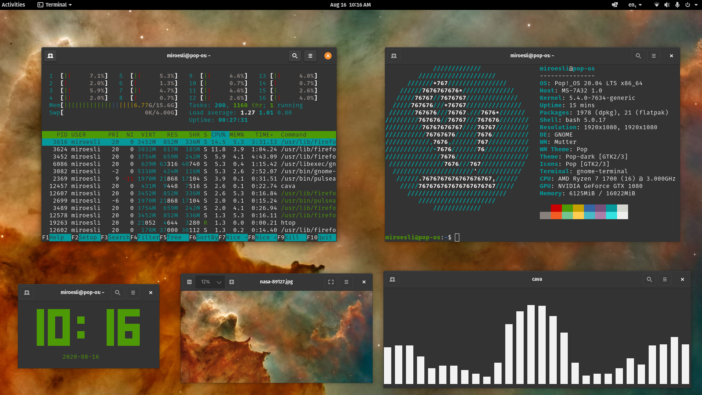

# Pop-os

## About

OS: [Pop!\_os](https://pop.system76.com/)\
WM: [Pop_Shell](https://github.com/pop-os/shell)\
Terminal: [gnome-terminal](https://www.archlinux.org/packages/extra/x86_64/gnome-terminal/)\
File manager: Default Pop!\_OS File Viewer\
Web browser: [firefox](https://www.archlinux.org/packages/extra/x86_64/firefox/)\
Lockscreen: [gdm](https://wiki.archlinux.org/index.php/GDM)\
Wallpaper: [Nasa Pillars of Creation](https://images.unsplash.com/photo-1462332420958-a05d1e002413?ixlib=rb-1.2.1&ixid=eyJhcHBfaWQiOjEyMDd9&auto=format&fit=crop&w=1940&q=80)\

## Tools in Screenshot

- htop - Resource usage viewer
- neofetch - CLI system info viewer
- cava - sound visualizer
- tty-clock
- ranger - file browser

## Apps

- Discord
- Spotify
- Steam
- Signal
- Slack
- Firefox
- Vscodium
- htop
- Zoom

## Languages

- Go
- Python
